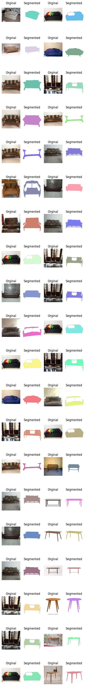

# Furniture segmentation with Facebook Anything SAM model


## Project Overview
In this task I mainly used Facebook anything Sam model on the furniture dataset which has YOLO format bounding box. I converted YOLO format to OpenCv format and then passed to predict segmentation with SAM model. 

## Installation

To set up the project environment:
#### 1-method

```bash
git clone https://github.com/cengineer13/Furniture-segmentation-Facebook-Anything-SAM-model
cd project root folder
pip install -r requirements.txt
```

#### 2-method

Create a virtual environment using txt file:

- Create a virtual environment:

```python
conda create -n env python=3.10
```

- Activate the environment using the following command:

```python
conda activate env
```

- Install libraries from the text file:

```python
pip install -r requirements.txt
```

## Dataset

This dataset was originally created by Minoj Selvaraj. To see the current project, which may have been updated since this version, please go here: https://universe.roboflow.com/minoj-selvaraj/furniture-sfocl.

This dataset is part of RF100, an Intel-sponsored initiative to create a new object detection benchmark for model generalizability.

* Download dataset from the [link](https://universe.roboflow.com/roboflow-100/furniture-ngpea)

## Main file 
Please run this file on jupyter notebook or other tools. I remained .ipynb file as it is comfortable than python file. 

```python
sam_furniture_segment.ipynb

```
! Other .ipynb files are related to SAM model including autogenerate mask, batch prediction and so on. 


## Inference

Here's how the model after segmentation: 



It will pick up randomly 20 images and make a predict for segmentation. 

## Contributing

We welcome contributions from the community. Please read the contributing guidelines first before making a pull request.


## Contact

Mr Murodil  - murodild@gmail.com
LinkedIn - https://www.linkedin.com/in/mr-murodil
Portfolio Link: [www.cengineer.uz](http://www.cengineer.uz)
